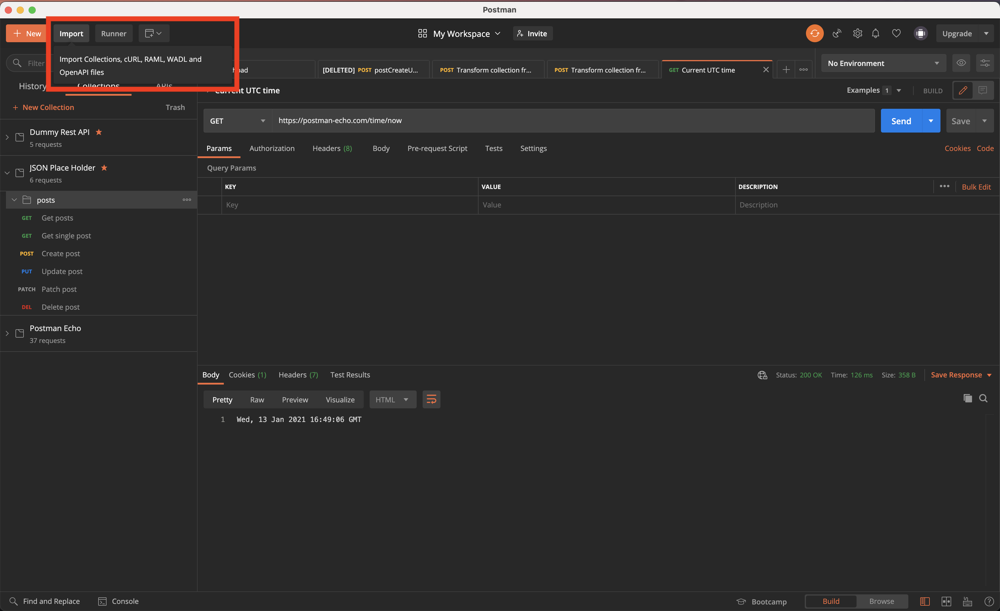
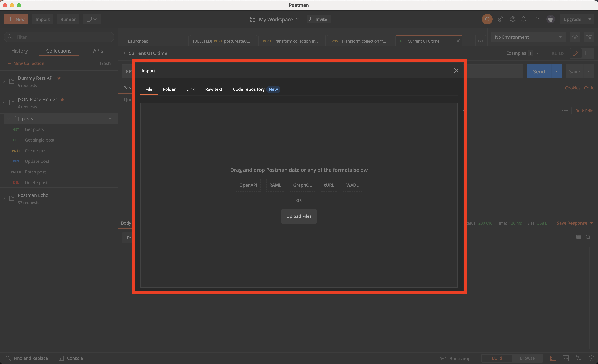
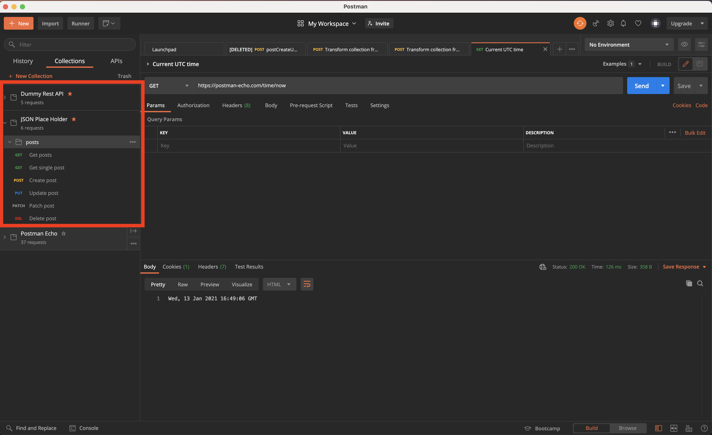

<!-- PROJECT SHIELDS -->
<!--
*** I'm using markdown "reference style" links for readability.
*** Reference links are enclosed in brackets [ ] instead of parentheses ( ).
*** See the bottom of this document for the declaration of the reference variables
*** for contributors-url, forks-url, etc. This is an optional, concise syntax you may use.
*** https://www.markdownguide.org/basic-syntax/#reference-style-links
-->
[![Contributors][contributors-shield]][contributors-url]
[![Forks][forks-shield]][forks-url]
[![Stargazers][stars-shield]][stars-url]
[![Issues][issues-shield]][issues-url]
[![MIT License][license-shield]][license-url]
[![LinkedIn][linkedin-shield]][linkedin-url]


<!-- PROJECT LOGO -->
<br />
<p align="center">
  <a href="https://github.com/victorgreco/postman-api-catalog">
    
  </a>

  <h3 align="center">Postman API Catalog</h3>

  <p align="center">
    Test a sort of cool and useful apis !
    <br />
    <a href="https://github.com/victorgreco/postman-api-catalog"><strong>Explore the docs »</strong></a>
    <br />
    <br />
    <a href="https://github.com/victorgreco/postman-api-catalog">View Demo</a>
    ·
    <a href="https://github.com/victorgreco/postman-api-catalog/issues">Report Bug</a>
    ·
    <a href="https://github.com/victorgreco/postman-api-catalog/issues">Request Feature</a>
  </p>
</p>

<!-- ABOUT THE PROJECT -->
## About The Project
[![Product Name Screen Shot][product-screenshot]](https://example.com)

Open repository to share cool API and how to use it via postman. 

<!-- ACKNOWLEDGEMENTS -->
## Supported APIs

* [Dummy Rest API](http://dummy.restapiexample.com/)
* [JSON Place Holder](https://jsonplaceholder.typicode.com/)
* [iTunes Store](https://affiliate.itunes.apple.com/resources/documentation/itunes-store-web-service-search-api/)
* [Liferay Country](https://www.liferay.com/api/jsonws/country/get-countries/)

<!-- GETTING STARTED -->
## Getting Started

### Prerequisites

* [Create account](https://identity.getpostman.com/login)

* I really 💛 the desktop version [download it here](https://www.postman.com/downloads/) ! <br> 

### Installation

1. **Clone the postman-api-catalog**

```sh
git clone https://github.com/victorgreco/postman-api-catalog.git
```

2. **Open Postman Desktop version**

3. **Select import**



4. **Choose the JSON file you want to import**



2. **You're ready to test APIs !**



<!-- CONTRIBUTING -->
## Contributing

Contributions are what make the open source community such an amazing place to be learn, inspire, and create. Any contributions you make are **greatly appreciated**.

1. Fork the Project
2. Create your Feature Branch (`git checkout -b feature/AmazingFeature`)
3. Commit your Changes (`git commit -m 'Add some AmazingFeature'`)
4. Push to the Branch (`git push origin feature/AmazingFeature`)
5. Open a Pull Request

<!-- LICENSE -->
## License

Distributed under the MIT License. See `LICENSE` for more information.


<!-- CONTACT -->
## Contact

Victor Greco - [linkedin](https://www.linkedin.com/in/victor-greco/) - victorgreco263@gmail.com

Project Link: [https://github.com/victorgreco/postman-api-catalog](https://github.com/victorgreco/postman-api-catalog)


<!-- MARKDOWN LINKS & IMAGES -->
<!-- https://www.markdownguide.org/basic-syntax/#reference-style-links -->
[contributors-shield]: https://img.shields.io/github/contributors/victorgreco/postman-api-catalog.svg?style=flat-square
[contributors-url]: https://github.com/victorgreco/postman-api-catalog/graphs/contributors
[forks-shield]: https://img.shields.io/github/forks/victorgreco/postman-api-catalog.svg?style=flat-square
[forks-url]: https://github.com/victorgreco/postman-api-catalog/network/members
[stars-shield]: https://img.shields.io/github/stars/victorgreco/postman-api-catalog.svg?style=flat-square
[stars-url]: https://github.com/victorgreco/postman-api-catalog/stargazers
[issues-shield]: https://img.shields.io/github/issues/victorgreco/postman-api-catalog.svg?style=flat-square
[issues-url]: https://github.com/victorgreco/postman-api-catalog/issues
[license-shield]: https://img.shields.io/github/license/victorgreco/postman-api-catalog.svg?style=flat-square
[license-url]: https://github.com/victorgreco/postman-api-catalog/blob/master/LICENSE.txt
[linkedin-shield]: https://img.shields.io/badge/-LinkedIn-black.svg?style=flat-square&logo=linkedin&colorB=555
[linkedin-url]: https://www.linkedin.com/in/victor-greco/
[product-screenshot]: images/screenshot.png
